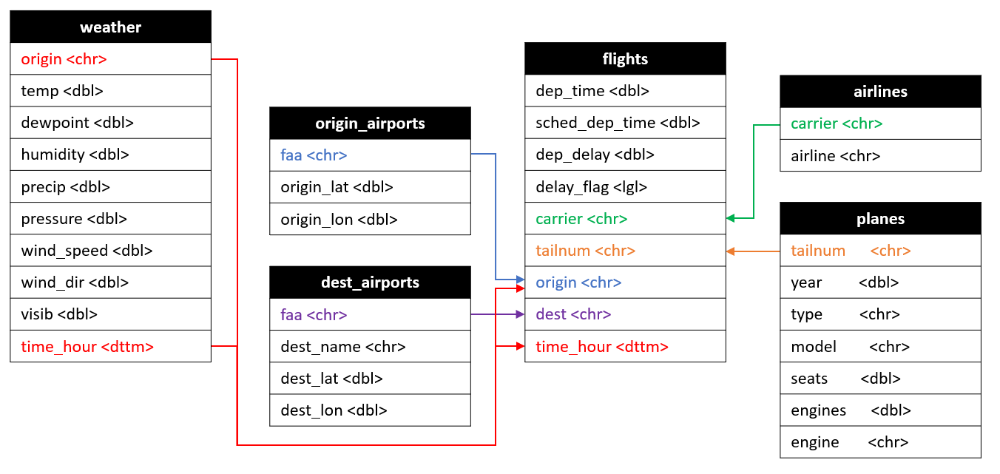

# New York City Flight Delays

## Context

### Business intelligence and data-driven decision making

Newark airport wish to investigate the effect of weather on departure delays. They believe poor weather conditions are causing too many delays and want to invest in improving facilities so that aircraft can take off in more types of weather. However, they do not fully understand how serious weather related delays are and are not sure what type of weather they should be most concerned about.

As part of the investigation other factors will be explored to understand how important weather is in comparison to them.  
  
They also want to understand how they compare to other New York airports.

My analysis will attempt to answer the following questions, to help the airport with infrastructure planning:

- Is the number of delayed flights at Newark significantly greater than at other New York airports?
- To what extent does extreme weather coincide with disruption of travel?
- Is weather a main cause of cancellations?
- Can the airport use weather forecasts to improve passenger experience?

### Domain knowledge and the business context

There are three major airports located close to New York City: John F. Kennedy International Airport, Newark Liberty International Airport, and LaGuardia Airport. In 2017 the airports handled 29.5, 21.6 and 14.6 million departing passengers, respectively, placing them all in the top 20 busiest airports in the USA. Approximately 53% of departures from JFK Airport were bound for domestic destinations, while Newark had 70% and LaGuardia 92% of flights serving US destinations.  Newark regularly features in lists of "worst" US airports, with delays, cancellations, poor amenities and an inconvenient location cited amongst it's failures. According to travel writers *Frommers* in 2022, "You know things have to be bad when even LaGuardia looks like a better option."

Reducing flight delays has been ranked as one of the aviation industry's top goals and a number of potential solutions have been investigated. The Federal Aviation Administration (FAA) considers a flight to be delayed when it is 15 minutes later than its scheduled time. Investment in airport infrastructure, including adding runways, increasing terminal capacity and airport surface management systems to help reduce runway congestion can help improve efficiency. An alternate strategy is to schedule and plan more effectively. According to Morrison and Winston (2007), airlines can reduce aircraft delays by managing flight schedules better and being better equipped to deal with unforeseen circumstances like weather delays.

The analysis undertaken will aim to identify where severe weather has been a factor in delaying flights and whether measures can be suggested to mitigate these factors.

Sources:

- [Port Authority of NY & NJ 2017 Annual Airport Traffic Report](https://www.panynj.gov/airports/en/statistics-general-info.html)
- [Investigating the Costs and Economic Impact of Flight Delays...Ashmith Anupkumar, May 2023](https://scholarworks.lib.csusb.edu/cgi/viewcontent.cgi?article=2885&context=etd)
- [The 10 Worst Airports in the U.S. - Frommers, Jan 2022](https://www.frommers.com/slideshows/848240-the-10-worst-airports-in-the-u-s)

## Data

### Internal and external data sources

Five pieces of data were provided by Newark airport:  

- Airlines: Connects the two-letter acronym for twelve US airlines to their full name (12 observations of 2 variables)
- Airports: Information about US airports (1333 observations of 8 variables, including geospacial data)
- Flights: Details on domestic flights that departed the three main NYC airports in 2017 (303748 observations of 19 variables)
- Planes: Details of over aircraft in service in the US in 2017 (3521 observations of 9 variables)
- Weather: Hourly weather data from the three major NYC airports from 2017 (26201 observations of 15 variables)

Weather data was supplemented with more detailed and complete data from
[NASA](https://power.larc.nasa.gov/data-access-viewer/). 

Information on severe weather events was accessed from the
[National Weather Service Archive](https://www.weather.gov/okx/stormevents)

Snowfall data was obtained from [National Centers for Environmental Information](https://www.ncei.noaa.gov/access/monitoring/daily-snow/NJ/snowfall/20170101).

### Types of data

The raw data contained

- categorical data, such as codes for origin and destination airports, airlines and types of aircraft
- continuous numeric data, such as temperature, precipitation, latitude and longitude
- discrete numeric data, such as number of engines
- integers, such as the number of minutes a flight was delayed by

During the data clean, columns were wrangled to produce

- logical data, in the form of a Boolean indicating whether a flight was delayed by 15 minutes or more
- datetime, which was coerced from separate day/month/year/hour columns using lubridate.

### Data formats

Data provided by the airport came in the form of CSV files.

Using GPS locations of the departure airports, more detailed weather data was obtained from [NASA](https://power.larc.nasa.gov/data-access-viewer/). This data came in CSV format and needed some header rows removed before being merged.

Snowfall for the airport weather stations was obtained from [National Centers for Environmental Information](https://www.ncei.noaa.gov/access/monitoring/daily-snow/NJ/snowfall/20170101) in CSV format. 24 files needed first tidied, then bound to give a coherent snowfall dataset for the year. This was neatly accomplished using a for-loop.

Information from the [National Weather Service](https://www.weather.gov/okx/stormevents) concerning significant weather events was first tidied in Excel before being imported as a CSV file.

### Data quality and bias

The data provided was for departing domestic flights from three New York airports, for twelve US airlines, from 2017. This may be detailed enough to be able to draw some conclusions for departure delays, but is not likely to be representative for international travel or for airports in different geographical locations. The absence of *all* flight data (including international flights) makes it more challenging to surmise when a delay could have been related to other factors such as congested runways or shortage of baggage handlers. Additionally, without being given a clear reason for a flight delay, such as aircraft malfunction or staffing issues it is difficult to hone in on weather being a contributory factor.

On close inspection, weather data had lot of missing information so it was supplemented by accessing [NASA weather data](https://power.larc.nasa.gov/data-access-viewer/). The newly obtained data contained hourly readings from each of the airports for temperature, dewpoint, relative humidity, precipitation, surface pressure, wind speed and wind direction. This was complete and gave increased accuracy over the weather data provided. Visibility was obtained from the original data, with missingness dealt with using adjacent readings or daily medians.

The planes dataset contained information on a large number of aircraft, but the data did not appear to be very relevant to analysis. Amongst the planes were ten aircraft with no seats. The tail numbers and models were found to correspond to small unmanned drones. However, when the tail numbers of these aircraft was compared to flight data, the drones were apparently flying a relatively large number of journeys (631 in total), for major airlines, to destinations thousands of miles away. Attempts to verify the data did not shed light on this anomaly. Aside from the fact that plane information was not particularly informative, the doubt surrounding accuracy caused it to be omitted from the analysis.

Flights data contained almost 8000 flights, from over 300,000, without departure or arrival times. This was taken to indicate cancelled departures so became pertinent to analysis of possible weather-related disruption.

Airport data was missing information on Puerto Rican airports. Puerto Rico is an unincorporated territory of the United States but flights there were included in the flight data so the missing airports were added to the airports data set for completeness.

## Ethics

### Ethical issues in data sourcing and extraction

The data was originally sourced by Github user jayleetx.

Flight data is publicly available through the FAA (Federal Aviation Administration). Some aircraft owners, however, register on a block list to prevent disclosure of their flight activity and it is assumed that these aircraft are excluding from all of our data sets. The data does not contain information on individual customers.

The public nature of flight, aircraft, airport and weather data minimises any ethical concerns.

### Ethical implications of business requirements

The business is looking to improve efficiency of the airport by reducing weather-related delays. This would benefit the airport, airlines and individual customers. One could argue that improving airport efficiency could have a negative environmental impact but that is beyond the scope of this analysis.

## Analysis

### Stages in the data analysis process

Before starting any analysis, a folder system was put in place for raw data, clean data, cleaning scripts, analysis notebooks, final presentation and images. The raw data was downloaded to the raw data folder and a single project started in R Studio, that would be the base for the investigation.

An initial exploration of the data allowed me to become acquainted with some of the trends and missingness.  A plan was formed on how to source additional weather information and on which key features should be part of the final, cleaned, data. A star schema was drawn to map out how the datasets could join using matching keys. After cleaning and joining, clean data was saved to the appropriate folder and tested in the same notebook as initial exploration had taken place. Collectively, this took around two days. After the cleaning and joining of the various data sources, my main file contained 303748 observations of 28 variables.

Each of the questions was investigated in a separate R notebook, with roughly one day spent answering each question. Work on modelling, for the fourth question took two days, with additional weather data, on snowfall, being collected and cleaned.

A presentation template was chosen along with a colour scheme for visualisations. I then went back through the notebooks, improving visualisations and exporting images that were to be used in the presentation. The presentation was gradually pieced together, question by question.

When finished, the presentation was refined, with some slides being removed to improve timekeeping while not sacrificing the main points that I needed to get across.

### Tools for data analysis

- R Studio was used for the majority of data wrangling, analysis and visualisations.
- Jupyter Notebook was used for some machine learning that was ultimately not used.
- PowerPoint was used for the presentation and sketching the star schema.
- Github was used to manage files.
- Slack and Zoom were used for communicating with instructors.

### Descriptive, diagnostic, predictive and prescriptive analysis

**Descriptive Analytics**
In order to answer my first query, *Is the number of delayed flights at Newark significantly greater than at other New York airports?* The project analyses data from 2017 for trends at Newark airport in comparison to the other NYC airports. Past events are used to describe the airports' performance in terms of flight delays. Later, cancellations and delays are examined alongside weather events.  Supported by visualisations and a hypothesis test, it was possible to say that *You were significantly more likely to be delayed if flying from Newark than other NYC airports*.  
  
**Diagnostic Analytics**
Using detailed weather data, connections were sought into possible reasons for delays. It was possible to diagnose some, but not all, of the spikes in disruption by matching severe weather events on certain dates. This helped to answer my second and third questions: *To what extent does extreme weather coincide with disruption of travel?* and *Is weather a main cause of cancellations?*.  Supported by the analysis, the conclusions were reached that *When severe weather occurs, on average we see more delays, longer delays and many more cancellations. However, not every severe weather event leads to disruption*.  
  
**Predictive Analytics**
My fourth question, *Can the airport use weather forecasts to improve passenger experience?*, was answered by attempting to create a model that would try to predict the probability of flight disruption in the future given a number of predictors. *With the data supplied we are able to build a reasonable model*  
  
**Prescriptive Analytics**
In the presentation, recommendations were made based on the analysis that had taken place. The purpose of some of these would be to improve any future analysis and to improve the predictive model for disruption.

- Greater time on schedules; target routes that are frequently delayed
- Increase ground crew in winter and after 3 pm
- Further investigation into reasons for delays
- Continue to refine predictive model
- Anticipate cancellations and rerouting; increase staffing accordingly
- Take steps to improve customer experience in the event of delay